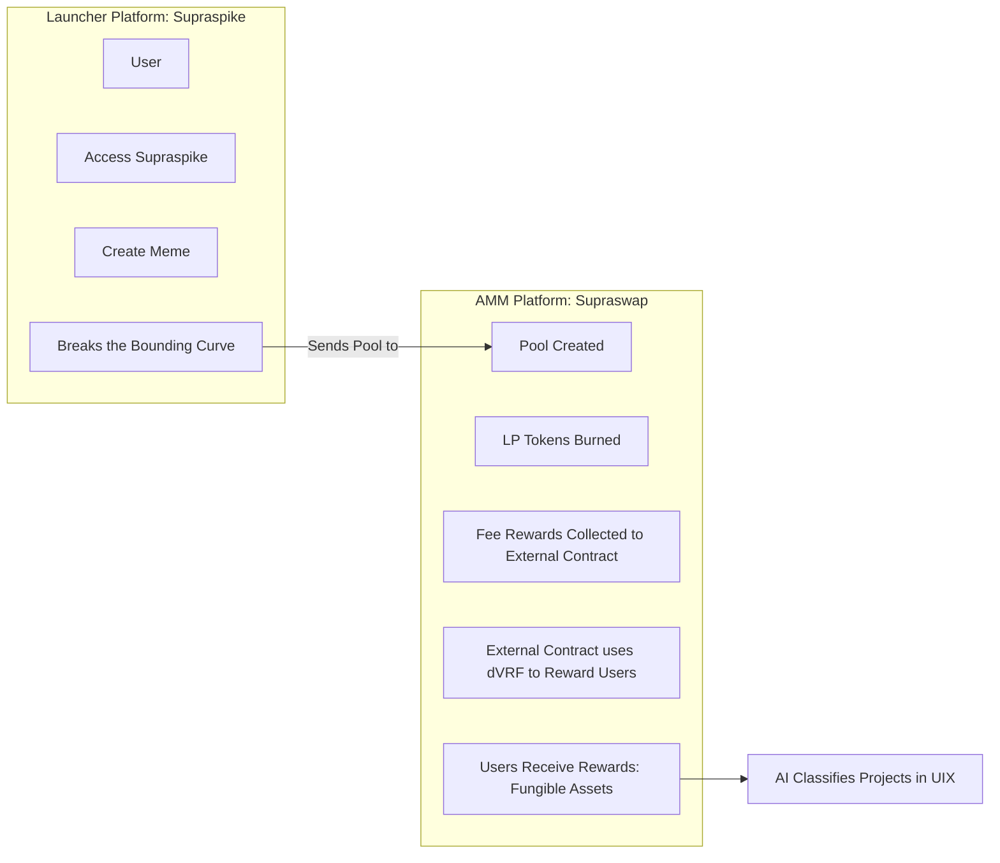
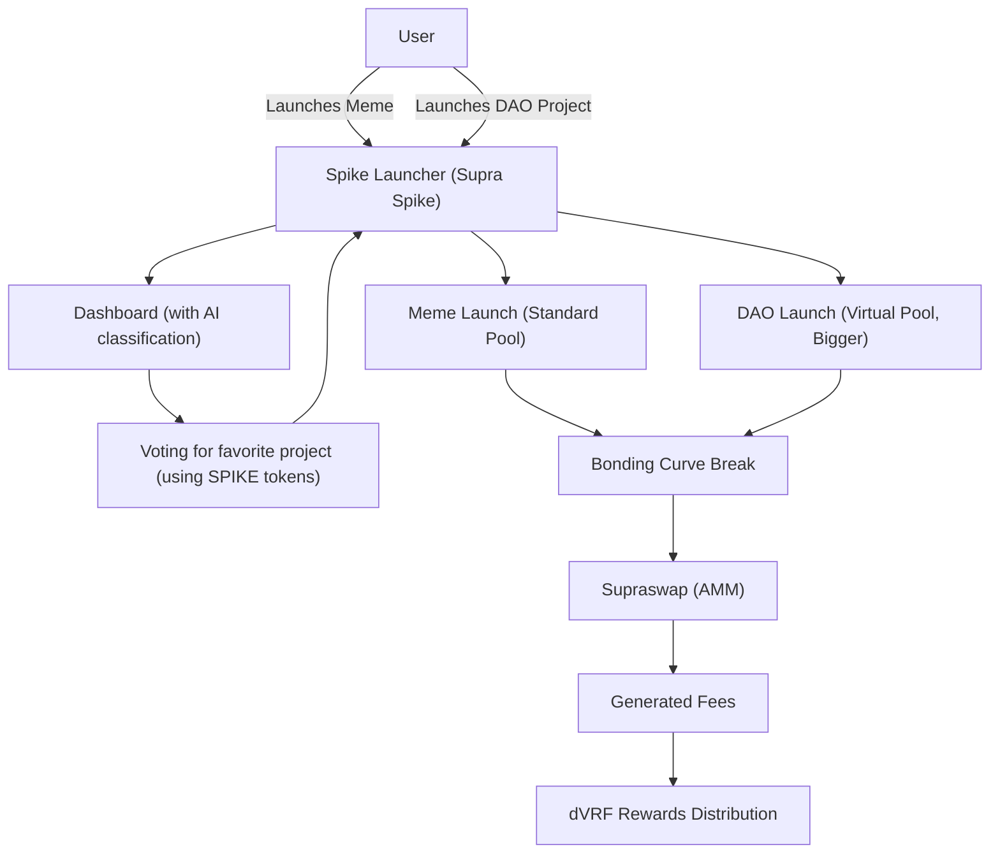

# Supra Spike: The Ultimate Launchpad on Supra Oracles

Welcome to Supra Spike, the first meme on Supra Oracles and a token and project launch platform built on the Supra Oracles blockchain. Our narrative is simple yet powerful: **Spike creates things**. We started as a space for memes, but now we're evolving into a launchpad that combines fun with serious innovation, bringing to life both speculative projects and real utility initiatives (DAOs).

## What is Supra Spike?

Supra Spike is an ecosystem composed of three key platforms:

- **Chat**: A community hub powered by real-time crypto data from external APIs, designed to help new users understand the crypto world easily.
- **AMM (SupraSwap)**: Our decentralized exchange for launched tokens, utilizing fungible assets for seamless trading.
- **Token Launcher**: Inspired by Pump.fun, it allows users to launch memes and serious projects (DAOs) with ease.

Our mission is to democratize token launching on Supra Oracles, providing a space where anyone can create, launch, and grow—whether it’s a fun meme or a project with real impact. We are especially focused on attracting new users and people with no prior crypto experience, making the crypto world accessible and easy to understand.

## How Does Supra Spike Work?

### 1. The Token Launcher

The heart of Supra Spike is its **Token Launcher**, where users can bring their ideas to life:

#### Meme Launches:
- A user creates a meme token on the launcher.
- This token starts with a virtual pool and follows a bounding curve.
- If the token "breaks" the bounding curve (reaches a threshold of volume or interest), it is officially launched on **SupraSwap**.

#### DAO Launches:
- Similar to memes, but with a focus on utility and larger pools.
- DAOs are real projects designed to generate long-term value.
- They follow the same process: if they break the bounding curve, they move to **SupraSwap**.

### 2. The Bounding Curve

The bounding curve is the mechanism that determines if a token is ready to make the leap:
- It represents a limit based on trading volume, liquidity, or engagement.
- When a meme or DAO "breaks" it, a real pool is created on **SupraSwap**.

### 3. SupraSwap and Fees

Once on SupraSwap, these fungible tokens generate fees through trading.
- These fees are distributed randomly among users using **Supra Oracles’ dVRF (Verifiable Random Function)**, ensuring transparency and fairness.

### 4. Project Filtering

We prioritize quality over quantity with a double-filter system:
- **AI Filtering**: An artificial intelligence analyzes proposals, classifying them based on potential and originality, then displays them on a public dashboard.
- **DAO (Community) Voting**: Users vote for their favorite projects on the dashboard, deciding which ones have the most potential.

This ensures only the best memes and DAOs advance.

### 5. The Chat: Real-Time Crypto Data for Everyone

Our **Chat** platform is designed to help new users and those unfamiliar with crypto by providing real-time crypto data in a simple, digestible way:
- **APIs Integration**: Connects to external APIs from various platforms to fetch live crypto data.
- **User-Friendly Interface**: Simplifies complex crypto information, helping newcomers navigate the crypto world with confidence.
- **Community Hub**: A space for users to ask questions, share insights, and learn from each other.

## Differences Between Memes and DAOs

| Aspect   | Memes               | DAOs                        |
|----------|---------------------|-----------------------------|
| Purpose  | Fun and speculation | Real utility and innovation |
| Pool Size| Small (virtual)     | Large (virtual)             |
| Focus    | Quick and light     | Serious and sustainable     |
| Path     | Launcher → SupraSwap| Launcher → SupraSwap        |

## Key Features

- **Token Launcher**: Launch memes or DAOs in minutes using Move contracts.
- **AI Filtering**: Automatic project classification to highlight the best.
- **DAO Governance**: The community decides which projects deserve to shine.
- **Fee Distribution**: Fees generated on SupraSwap are distributed via dVRF.
- **AMM with Fungible Assets**: Facilitates trading of fungible tokens launched through the platform.
- **Real-Time Chat**: Powered by external APIs for live crypto data, making it easy for newcomers to understand the crypto world.
- **Complete Ecosystem**: Chat, AMM, and Launcher work together for a stronger Supra.

## Development Status

- **Token Launcher**: On testnet, allowing launches and tests of memes and DAOs. We will move to mainnet when SupraSwap is ready.
- **SupraSwap**: In development; it will be the home for tokens that break the bounding curve.
- **AI and DAO Filtering**: System in progress, with AI classification and a voting dashboard on the way.
- **Chat**: Already active, connecting the community at [chat.supraspike.fun](https://chat.supraspike.fun).

## Our Vision

At Supra Spike, the first meme on Supra, we believe that Spike creates things—from hilarious memes to game-changing DAOs. We aim to:
- Be the leading launchpad on Supra Oracles.
- Foster an ecosystem where fun and innovation coexist.
- Empower the community to decide which projects deserve to grow.
- Turn Supra into a hub for real value creation, beyond speculation.
- Make crypto accessible to everyone, especially those new to the space.

## Join Supra Spike

Be part of this revolution! Help us build the future of launches on Supra Oracles.
- **Launcher Website**: [supraspike.fun](https://supraspike.fun)
- **AMM Website**: [supraswap.lol](https://supraswap.lol)
- **Community Chat**: [chat.supraspike.fun](https://chat.supraspike.fun)
- **Telegram**: [Join here](#)
- **Twitter**: [Follow us](#)
- **Medium**: [Read more](#)

## Meet the Team

- **Daniela DeFi** – [@chicablockchain](#)
- **Snabur** – [@ZAMBURXD](#)
- **Maira** – [@criptoMaira](#)
- **Jaione** – [@jaionee](#)
- **Mr Ga** – [@mpb_algos](#)

---

## 🚀 SupraSpike Platform Flow Diagram

Currently, our platform is in testnet. The flow diagram below explains the future functionality of SupraSpike, where we launch token pools and track events. Our final vision is to incorporate meme launches with virtual liquidity for DAOS (500k virtual pool) and Memetokens (5k virtual pool). Additionally, AI will supervise the data from database and identify the best ideas to present them to the community for voting.

### Diagrama 2: Platform Architecture in future

