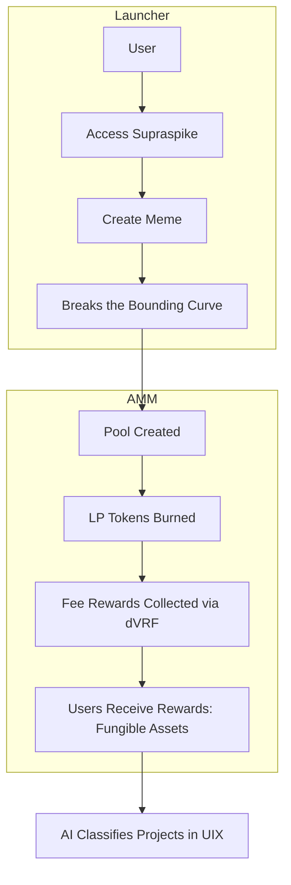
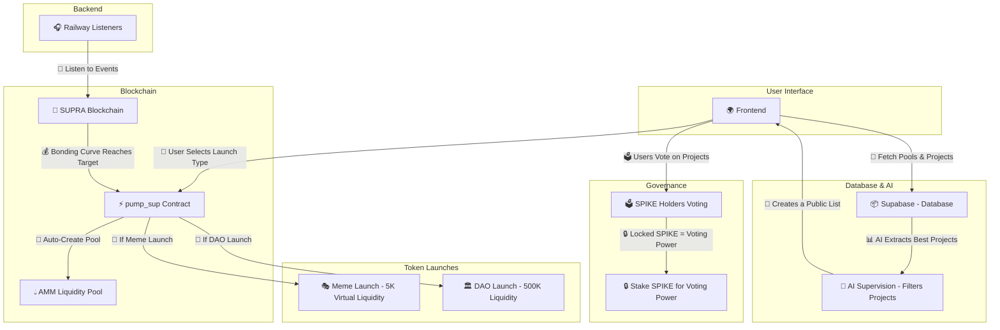

# 🚀 Supra Spike: The Next-Gen Token & Project Launcher on Supra Oracles  

Welcome to **Supra Spike**, the ultimate **meme and project launcher** built on the **Supra Oracles** blockchain. While we started as a **meme-focused platform**, we aim to **expand beyond memes**, creating a space where both fun and **serious, utility-driven projects** can thrive.  

---

## 🔥 What is Supra Spike?  

Supra Spike is a **token and project launchpad** that empowers creators to bring their ideas to life using **Move smart contracts**. Our goal is to **grow the Supra ecosystem**, not just as a place for speculation but as a **hub for real innovation**.  

With **Supra Spike**, we aim to:  
✅ **Launch tokens easily** – Whether it's a meme or a serious utility token, our platform simplifies the process.  
✅ **Support real innovation** – We provide tools to **crowdfund ideas**, making it easier for projects with real potential to get funded.  
✅ **Grow the ecosystem** – By enabling both fun and meaningful projects, we help expand Supra beyond just speculation.  

---

## 🌟 Key Features  

- **🛠 Token Factory** – Launch tokens seamlessly with Move-based smart contracts.  
- **🎭 Meme & Utility Project Launches** – A diverse space for both memes and serious blockchain projects.  
- **📊 AI-Powered Leaderboard** – Highlighting the best ideas based on quality and innovation.  
- **🎨 First-Ever Supra NFT Collection** – Combining creativity with blockchain utility.  

---

## 📌 Development Status  

🔹 **Token Launcher**: Currently in **testnet**, allowing users to create, deploy, and trade tokens easily. We plan to launch on **mainnet** once Automated Market Makers (AMMs) are live.  

🔹 **AI-Powered Project Filtering & Governance**: We are developing an **AI-driven filtering system** that will analyze project proposals and highlight **truly innovative ideas**. This AI will act as a **first filter**, identifying promising projects while reducing the chances of scams or low-quality initiatives.  

🔹 **Community Governance Voting**: After passing the **AI filter**, projects will go through a **community voting process** via **Spike governance mechanisms**. This ensures a **double-layered filtering system** where only the most **valuable and high-potential** projects get community support and visibility.  

This **dual validation system (AI + Governance)** will help maintain a **high standard for projects launched on Supra**, ensuring real innovation while **empowering the Spike community** to shape the ecosystem.  

## 🛠 Smart Contracts  

Supra Spike leverages **Move contracts** to provide seamless functionality for **token launches, NFTs, and IDOs**. Below are the key contracts:  

### 🔹 Pump FA Contract  

- **Address**: `0x6e3e09ab7fd0145d7befc0c68d6944ddc1a90fd45b8a6d28c76d8c48bed676b0::pump_sup`  
- **Functions**:  
  - `deploy` – Used for creating tokens.  
  - `buy` & `sell` – Enables users to trade tokens.  
- **Features**: Implements **virtual pools** similar to **Pump.fun** for efficient token distribution.  
- **Status**: Currently in **testnet**, with ongoing improvements.  

### 🔹 NFT Contract  

- **Address**: `0x6e3e09ab7fd0145d7befc0c68d6944ddc1a90fd45b8a6d28c76d8c48bed676b0::nft`  
- **Description**: Manages the **first-ever NFT collection** on Supra, showcasing creative potential.  

### 🔹 IDO Contract  

- **Address**: `0x6e3e09ab7fd0145d7befc0c68d6944ddc1a90fd45b8a6d28c76d8c48bed676b0::ido`  
- **Description**: Handles **token distributions** during the IDO phase to ensure **fair and transparent launches**.  

🚀 **This IDO is exclusively for our token, Spike**. We are committed to ensuring a **secure, community-driven launch**, with fair distribution and strong ecosystem integration.  

For more details about **tokenomics and contract functionality**, check out our **[Medium page](https://medium.com/@supraspike.fun/spike-tokenomics-and-contracts-bb7b8f15527e)**.  

## 🔹 Tokenomics & Distribution  

Our **tokenomics and distribution plan** can be found in detail on our **[Medium page](https://medium.com/@supraspike.fun/spike-tokenomics-and-contracts-bb7b8f15527e)**.  
We are committed to **transparency and fairness** in all our launches.  

---

## 💼 Team Roles

- **👨‍💻 Development & Strategy** – Led by a dedicated builder focused on **smart contracts** and **platform UI/UX**.
- **📢 Community & Engagement** – Managed by a passionate team ensuring **strong community support on Telegram and Twitter**.

## 🎬 Team Video Presentation

Check out our team introduction and demo in the following video:
[Video Presentation](https://youtu.be/Jw08FY1TR5k)

## 🚀 Our Team: DeFi and Crypto Ecosystem

We are constantly innovating and building since the **launch of Supra mainnet**.

- 🛠 **Daniela DeFi** – [@chicablockchain](https://x.com/chicablockchain)
- 🎭 **Snabur** – [@ZAMBURXD](https://x.com/ZAMBURXD)
- 💡 **Maira** – [@criptoMaira](https://x.com/criptoMaira)
- 🔥 **Jaione** – [@jaionee](https://x.com/jaionee)

We have been actively building and contributing to the **DeFi** and **crypto ecosystem**.

---  

## 🎯 Our Vision  

We want **Supra Oracles** to be more than just a blockchain—it should be a **launchpad for groundbreaking ideas**. With Supra Spike, we’re building:  

💡 **A trusted platform** for launching high-quality projects.  
📈 **An ecosystem that grows organically**, fueled by real innovation and community-driven initiatives.  
🤖 **AI-driven project evaluation**, ensuring that **serious projects get the attention they deserve**.  
🌎 **A fair and open crowdfunding space**, making it easier for innovative ideas to become reality.  

We are committed to making Supra **the go-to blockchain for token launches**—not just for speculation but for **real value creation**.  

## Join the Movement  

Be part of **Supra Spike** and help shape the **future of token launches**!  

🌐 **Website**: [supraspike.fun](https://supraspike.fun)  
💬 **Telegram**: [Join our community](https://t.me/supraspike)  
🐦 **Twitter**: [Follow us](https://x.com/supra_spikes)  
📝 **Medium**: [Read our insights](https://medium.com/@supraspike.fun/spike-tokenomics-and-contracts-bb7b8f15527e)  

---

## 🚀 SupraSpike Platform Flow Diagram

Currently, our platform is in testnet. The flow diagram below explains the future functionality of SupraSpike, where we launch token pools and track events. Our final vision is to incorporate meme launches with virtual liquidity for DAOS (500k virtual pool) and Memetokens (5k virtual pool). Additionally, AI will supervise the data from database and identify the best ideas to present them to the community for voting.

### Diagrama 2: Platform Architecture in future

