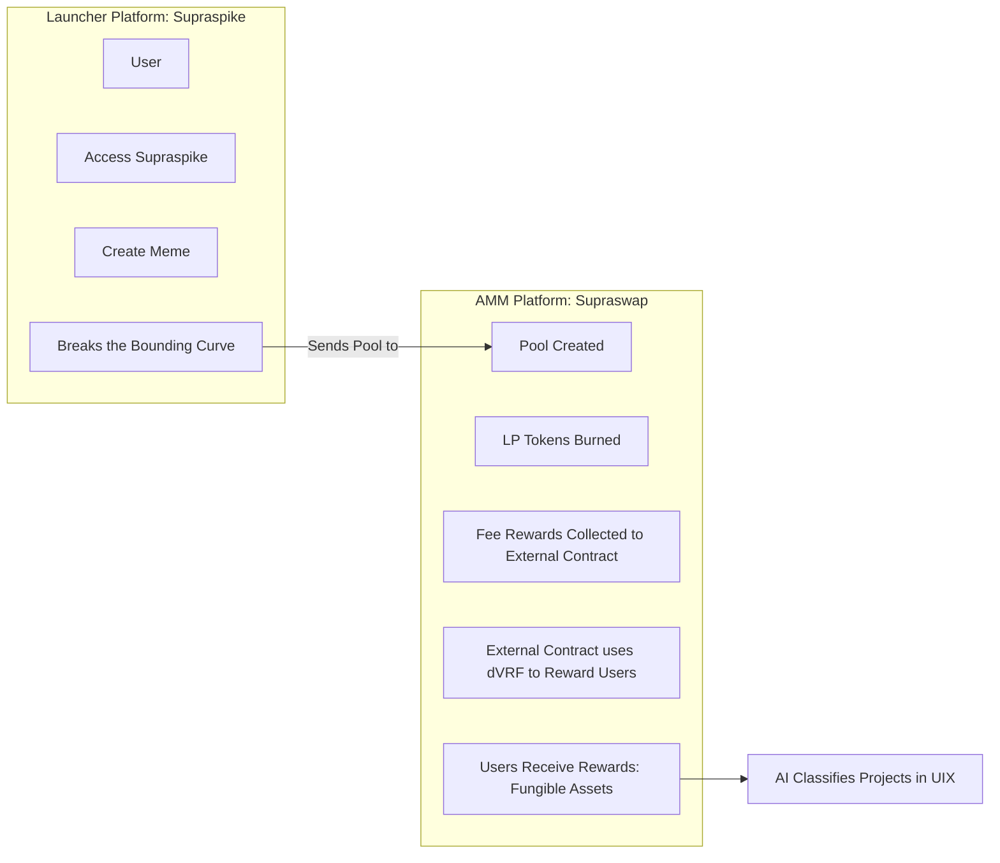
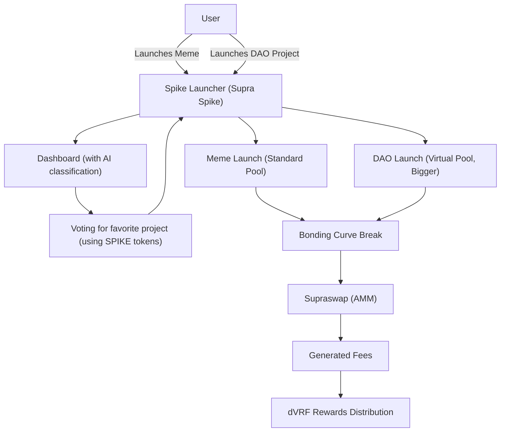

# 🚀 Supra Spike: The Ultimate Launchpad on Supra Oracles

Welcome to **Supra Spike**, the very first meme on Supra Oracles and a cutting-edge platform for launching tokens and projects on the Supra Oracles blockchain. Our motto is simple yet powerful: **Spike creates things!** A launchpad that blends fun with serious innovation, powering both speculative projects and genuine utility initiatives (DAOs).

---

## 🌟 What is Supra Spike?

Supra Spike is a dynamic ecosystem built around **three core platforms**:

- **💬 Chat:** A community hub offering real-time crypto data from external APIs, designed to help newcomers easily navigate the crypto world.
- **🔄 AMM (SupraSwap):** Our decentralized exchange for launched tokens, utilizing fungible assets for smooth trading experiences.
- **🚀 Token Launcher:** Inspired by Pump.fun, this tool allows users to effortlessly launch both memes and serious projects (DAOs).

> **Our Mission:** To democratize token launching on Supra Oracles, creating a space where anyone can create, launch, and grow—whether it's a playful meme or a project with lasting impact. We focus on making crypto accessible to all, especially those new to the space.

---

## 🔍 How Does Supra Spike Work?

### 1. **Token Launcher**

At the heart of Supra Spike is the **Token Launcher**, where innovative ideas come to life.

#### 🎉 Meme Launches:
- **Creation:** A user creates a meme token via the launcher.
- **Virtual Start:** The token starts with a virtual pool and follows a *bounding curve*.
- **Launch:** If the token "breaks" the curve (reaches a threshold of volume or interest), it officially launches on **SupraSwap**.

#### 💡 DAO Launches:
- **Focus:** Similar process to memes, but with emphasis on utility and larger pools.
- **Long-Term Value:** DAOs are real projects designed to generate lasting value.
- **Process:** They too follow the same trajectory: if they break the curve, they move to **SupraSwap**.

---

### 2. **The Bounding Curve**

The *bounding curve* is the mechanism that determines when a token is ready to take the leap:
- **Purpose:** It sets a limit based on trading volume, liquidity, or user engagement.
- **Outcome:** When a meme or DAO "breaks" this curve, a real pool is created on **SupraSwap**.

---

### 3. **SupraSwap and Fee Distribution**

Once on **SupraSwap**, the launched tokens generate trading fees.
- **Fee Distribution:** These fees are randomly distributed among users through the **dVRF (Verifiable Random Function)** provided by Supra Oracles, ensuring fairness and transparency.

---

### 4. **Project Filtering**

We prioritize quality over quantity using a robust dual-filter system:

- **🤖 AI Filtering:** An intelligent system analyzes proposals, classifying them based on potential and originality, then showcasing them on a public dashboard.
- **👥 Community Voting:** Users cast their votes for the projects they believe hold the most promise.

> **Result:** Only the best memes and DAOs advance to the next stage.

---

### 5. **Real-Time Crypto Chat**

Our **Chat** platform demystifies the crypto world, especially for newcomers:
- **🔌 API Integration:** Seamlessly connects to external APIs for live crypto data.
- **👀 User-Friendly:** Simplifies complex information into digestible insights.
- **🤝 Community Hub:** A vibrant space for asking questions, sharing knowledge, and learning together.

---

## 📊 Memes vs. DAOs

| **Aspect**         | **Memes**                     | **DAOs**                       |
|--------------------|-------------------------------|--------------------------------|
| **Purpose**        | Fun & speculation             | Real utility & innovation      |
| **Pool Size**      | Small (virtual)               | Large (virtual)                |
| **Focus**          | Quick & light                 | Serious & sustainable          |
| **Path**           | Launcher → SupraSwap          | Launcher → SupraSwap           |

---

## 🔑 Key Features

- **Token Launcher:** Launch memes or DAOs in minutes using Move contracts.
- **AI Filtering:** Automatic classification to highlight top projects.
- **DAO Governance:** Empowering the community to decide which projects shine.
- **Fee Distribution:** Trading fees on SupraSwap are distributed via dVRF.
- **AMM with Fungible Assets:** Facilitates seamless token trading.
- **Real-Time Chat:** Live crypto data simplifies complex market dynamics.
- **Complete Ecosystem:** Chat, AMM, and Launcher integrate to power a robust platform.

---

## 🚧 Development Status

- **Token Launcher:** Currently on testnet, enabling meme and DAO launches and tests. Migration to mainnet will occur once SupraSwap is ready.
- **SupraSwap:** In development; will serve as the home for tokens that break the bounding curve.
- **AI & DAO Filtering:** System is in progress with AI classification and an upcoming voting dashboard.
- **Chat:** Already live, connecting the community at [chat.supraspike.fun](https://chat.supraspike.fun).

---

## 🌈 Our Vision

At Supra Spike, we believe **Spike creates things!** From hilarious memes to revolutionary DAOs, our goals are to:
- Establish the premier launchpad on Supra Oracles.
- Foster an ecosystem where fun meets innovation.
- Empower our community to decide which projects deserve to grow.
- Transform Supra into a hub of real value creation, moving beyond mere speculation.
- Make crypto accessible to everyone, especially newcomers.

---

## 🤝 Join Supra Spike

Be part of the revolution and help us shape the future of launches on Supra Oracles!

- **🌐 Launcher Website:** [supraspike.fun](https://supraspike.fun)
- **🔄 AMM Website:** [supraswap.lol](https://supraswap.lol)
- **💬 Community Chat:** [chat.supraspike.fun](https://chat.supraspike.fun)
- **📲 Telegram:** [Join Here](#)
- **🐦 Twitter:** [Follow Us](#)
- **📝 Medium:** [Read More](#)

---

## 👥 Meet the Team

- **Daniela DeFi** – [@chicablockchain](#)
- **Snabur** – [@ZAMBURXD](#)
- **Maira** – [@criptoMaira](#)
- **Jaione** – [@jaionee](#)
- **Mr Ga** – [@mpb_algos](#)

---

## 🚀 SupraSpike Platform Flow Diagram

Currently, our platform is in testnet. The flow diagram below explains the future functionality of SupraSpike, where we launch token pools and track events. Our final vision is to incorporate meme launches with virtual liquidity for DAOS (500k virtual pool) and Memetokens (5k virtual pool). Additionally, AI will supervise the data from database and identify the best ideas to present them to the community for voting.

### Diagrama 2: Platform Architecture in future

