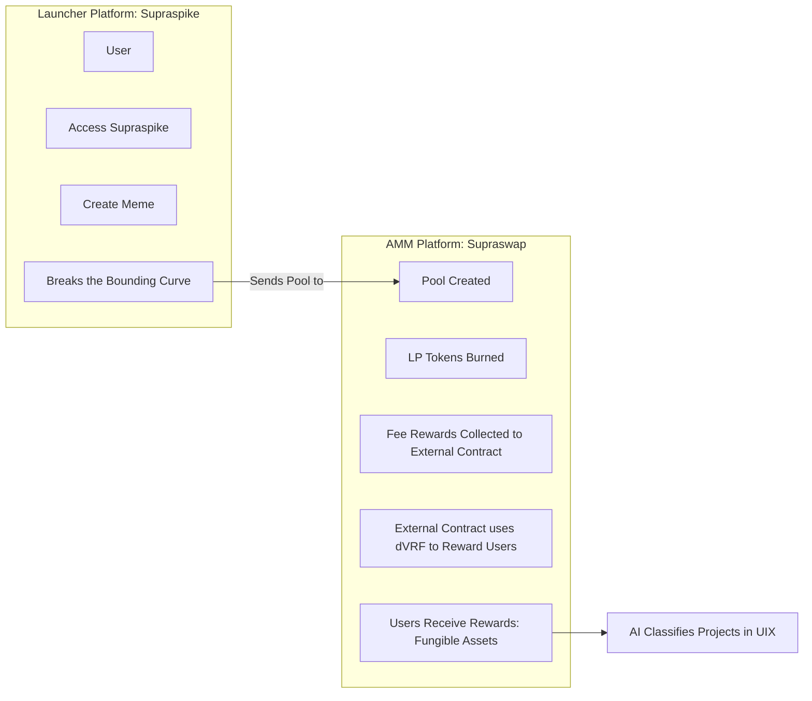
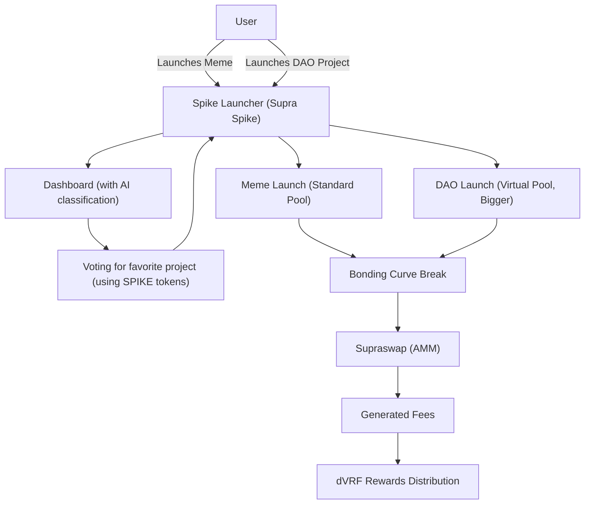

# 🚀 Supra Spike: The Ultimate Launchpad on Supra Oracles

Bienvenido a **Supra Spike**, el primer meme en Supra Oracles y una plataforma de lanzamiento para tokens y proyectos, construida sobre la blockchain de Supra Oracles. Nuestra idea es simple pero poderosa: **¡Spike crea cosas!** Lo que comenzó como un espacio para memes, ahora evoluciona hacia un launchpad que fusiona la diversión con la innovación real, dando vida tanto a proyectos especulativos como a iniciativas de utilidad (DAOs).

---

## 🌟 ¿Qué es Supra Spike?

Supra Spike es un ecosistema que integra **tres plataformas clave**:

- **💬 Chat:** Un centro comunitario impulsado por datos cripto en tiempo real provenientes de APIs externas, diseñado para que los nuevos usuarios comprendan el mundo cripto de forma sencilla.
- **🔄 AMM (SupraSwap):** Nuestro exchange descentralizado para tokens lanzados, que utiliza activos fungibles para facilitar el trading sin complicaciones.
- **🚀 Token Launcher:** Inspirado en Pump.fun, permite a los usuarios lanzar tanto memes como proyectos serios (DAOs) de manera ágil.

> **Misión:** Democratizar el lanzamiento de tokens en Supra Oracles, ofreciendo un espacio donde cualquiera pueda crear, lanzar y crecer—ya sea un divertido meme o un proyecto con impacto real. Nos enfocamos en atraer a nuevos usuarios y personas sin experiencia previa en cripto, haciendo el mundo cripto accesible y fácil de entender.

---

## 🔍 ¿Cómo Funciona Supra Spike?

### 1. **El Token Launcher**

El corazón de Supra Spike es su **Token Launcher**, donde las ideas se convierten en realidad.

#### 🎉 Meme Launches:
- **Creación:** El usuario crea un token meme en el launcher.
- **Inicio Virtual:** El token inicia con una piscina virtual y sigue una *bounding curve*.
- **Lanzamiento:** Si el token "rompe" la curva (alcanzando un umbral de volumen o interés), se lanza oficialmente en **SupraSwap**.

#### 💡 DAO Launches:
- **Enfoque:** Similar a los memes, pero centrado en la utilidad y en piscinas de mayor tamaño.
- **Valor a Largo Plazo:** Los DAOs son proyectos reales diseñados para generar valor sostenido.
- **Proceso:** Siguen el mismo proceso: si rompen la curva, pasan a **SupraSwap**.

---

### 2. **La Bounding Curve**

La *bounding curve* es el mecanismo que determina si un token está listo para el salto:
- **Función:** Representa un límite basado en el volumen de trading, liquidez o engagement.
- **Acción:** Al romperla, se crea una piscina real en **SupraSwap**.

---

### 3. **SupraSwap y la Distribución de Tarifas**

Una vez en **SupraSwap**, los tokens fungibles generan tarifas a través del trading.
- **Distribución de Tarifas:** Las tarifas se distribuyen aleatoriamente entre los usuarios utilizando el **dVRF (Verifiable Random Function)** de Supra Oracles, garantizando transparencia y equidad.

---

### 4. **Filtrado de Proyectos**

Priorizamos la calidad sobre la cantidad con un sistema de doble filtro:

- **🤖 Filtrado por IA:** Una inteligencia artificial analiza las propuestas, clasificándolas por potencial y originalidad, y las muestra en un tablero público.
- **👥 Votación Comunitaria:** Los usuarios votan por sus proyectos favoritos en el tablero, eligiendo cuáles tienen mayor potencial.

> **Resultado:** Solo avanzan los mejores memes y DAOs.

---

### 5. **El Chat: Datos Cripto en Tiempo Real para Todos**

Nuestro **Chat** está diseñado para simplificar el mundo cripto, especialmente para nuevos usuarios:
- **🔌 Integración de APIs:** Conecta con APIs externas para obtener datos cripto en vivo.
- **👀 Interfaz Amigable:** Facilita la comprensión de información compleja.
- **🤝 Comunidad:** Un espacio para preguntar, compartir y aprender en conjunto.

---

## 📊 Comparativa: Memes vs. DAOs

| **Aspecto** | **Memes**               | **DAOs**                        |
|-------------|-------------------------|---------------------------------|
| **Propósito**   | Diversión y especulación  | Utilidad real e innovación       |
| **Tamaño de Piscina** | Pequeña (virtual)       | Grande (virtual)                |
| **Enfoque**   | Rápido y ligero           | Serio y sostenible              |
| **Ruta**      | Launcher → SupraSwap      | Launcher → SupraSwap            |

---

## 🔑 Características Clave

- **Token Launcher:** Lanza memes o DAOs en minutos utilizando contratos *Move*.
- **Filtrado por IA:** Clasificación automática para destacar los mejores proyectos.
- **Gobernanza DAO:** La comunidad decide qué proyectos merecen brillar.
- **Distribución de Tarifas:** Las tarifas generadas en SupraSwap se reparten vía dVRF.
- **AMM con Activos Fungibles:** Facilita el trading de tokens lanzados a través de la plataforma.
- **Chat en Tiempo Real:** Datos cripto en vivo para que incluso los nuevos comprendan el mundo.
- **Ecosistema Completo:** Chat, AMM y Launcher trabajan en conjunto para potenciar Supra Spike.

---

## 🚧 Estado de Desarrollo

- **Token Launcher:** Actualmente en testnet, permitiendo el lanzamiento y prueba de memes y DAOs. Se migrará a mainnet cuando SupraSwap esté listo.
- **SupraSwap:** En desarrollo; será el hogar para los tokens que rompan la bounding curve.
- **Filtrado IA y DAO:** Sistema en progreso, con clasificación por IA y un tablero de votación en camino.
- **Chat:** Ya activo, conectando a la comunidad en [chat.supraspike.fun](https://chat.supraspike.fun).

---

## 🌈 Nuestra Visión

En Supra Spike, creemos que **¡Spike crea cosas!** Desde memes divertidísimos hasta DAOs revolucionarios, buscamos:
- Convertirnos en el launchpad líder en Supra Oracles.
- Fomentar un ecosistema donde la diversión y la innovación convivan.
- Empoderar a la comunidad para decidir qué proyectos deben crecer.
- Transformar Supra en un centro de creación de valor real, más allá de la especulación.
- Hacer que el cripto sea accesible para todos, especialmente para los nuevos en el mundo.

---

## 🤝 Únete a Supra Spike

¡Sé parte de esta revolución y ayudemos a construir el futuro de los lanzamientos en Supra Oracles!

- **🌐 Launcher Website:** [supraspike.fun](https://supraspike.fun)
- **🔄 AMM Website:** [supraswap.lol](https://supraswap.lol)
- **💬 Community Chat:** [chat.supraspike.fun](https://chat.supraspike.fun)
- **📲 Telegram:** [Únete aquí](#)
- **🐦 Twitter:** [Síguenos](#)
- **📝 Medium:** [Leer más](#)

---

## 👥 Conoce al Equipo

- **Daniela DeFi** – [@chicablockchain](#)
- **Snabur** – [@ZAMBURXD](#)
- **Maira** – [@criptoMaira](#)
- **Jaione** – [@jaionee](#)
- **Mr Ga** – [@mpb_algos](#)

---

## 🚀 SupraSpike Platform Flow Diagram

Currently, our platform is in testnet. The flow diagram below explains the future functionality of SupraSpike, where we launch token pools and track events. Our final vision is to incorporate meme launches with virtual liquidity for DAOS (500k virtual pool) and Memetokens (5k virtual pool). Additionally, AI will supervise the data from database and identify the best ideas to present them to the community for voting.

### Diagrama 2: Platform Architecture in future

